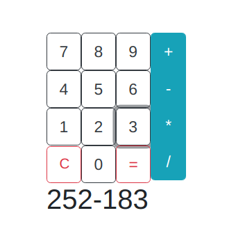

# frp-calculator
Simple calculator widget written in Haskell with [Reflex](https://github.com/reflex-frp/reflex), a functional reactive library. 

Compiled as a Javascript file with [Nix](https://github.com/NixOS/nix), using the seed provided [here](https://github.com/ElvishJerricco/reflex-project-skeleton).

## Usage 
Just copy the `output` folder and open `index.html` using your favorite browser.

## Source
Source files can be found in the `src` folder.

## Pictures
&nbsp; &nbsp; &nbsp; 

